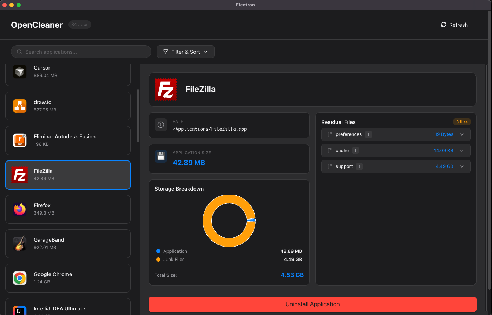

# OpenCleaner

A modern, native-looking macOS application uninstaller built with Electron. Completely removes applications along with their residual files (caches, preferences, logs, support files).


## Features

- **Complete Uninstallation** - Removes apps and all associated junk files
- **Modern UI** - Native macOS look with automatic dark mode support
- **Smart Detection** - Finds caches, logs, preferences, and support files
- **Visual Reports** - Storage charts and detailed uninstall reports
- **Safe Deletion** - Moves files to Trash (recoverable)
- **Drag & Drop** - Drag apps to uninstall zone
- **Search & Filter** - Find apps by name, filter by size

## Screenshots

| Light Mode | Dark Mode |
|------------|-----------|
|  |  |

## Installation

### Quick Install (Recommended)

Open Terminal and run:

```bash
/bin/bash -c "$(curl -fsSL https://raw.githubusercontent.com/aitorevi/open-cleaner/main/install.sh)"
```

Then launch with:
```bash
opencleaner
```

### Manual Install

1. **Prerequisites**: Install [Node.js](https://nodejs.org/) (v18 or higher)

2. **Clone the repository**:
   ```bash
   git clone https://github.com/aitorevi/open-cleaner.git
   cd open-cleaner
   ```

3. **Install dependencies**:
   ```bash
   npm install
   ```

4. **Run the app**:
   ```bash
   npm run dev
   ```

## Usage

1. **Grant Permissions**: On first launch, grant Full Disk Access in System Preferences
2. **Browse Apps**: See all installed applications with their sizes
3. **Search/Filter**: Use the search bar or filter by size category
4. **Select App**: Click on an app to see details and junk files
5. **Uninstall**: Click "Uninstall Application" or drag the app to the trash zone
6. **Review Report**: See exactly what was removed and space freed

## Why Run in Development Mode?

Due to macOS 15 Sequoia's strict code signing requirements, unsigned apps are blocked by Gatekeeper. Running in development mode (`npm run dev`) bypasses this limitation safely.

**This is NOT a security risk** - you're running the source code directly, which you can inspect yourself.

If you want to distribute a signed `.app`, you'll need an Apple Developer Certificate ($99/year).

## Tech Stack

- **Framework**: Electron 39 + Vite
- **Frontend**: React 19 + TypeScript
- **UI Components**: Radix UI primitives
- **Animations**: Framer Motion
- **Charts**: Recharts
- **Icons**: Lucide React

## Project Structure

```
src/
├── main/                 # Electron main process
│   ├── adapters/         # File system & app scanner
│   ├── ipc/              # IPC handlers
│   └── use-cases/        # Business logic
├── preload/              # Preload scripts (IPC bridge)
├── renderer/             # React frontend
│   └── src/
│       ├── components/   # UI components
│       ├── hooks/        # Custom React hooks
│       └── styles/       # Design system
└── shared/               # Shared types
```

## Development

```bash
# Run in development mode with hot reload
npm run dev

# Build for production (requires code signing for distribution)
npm run build:mac

# Lint code
npm run lint

# Format code
npm run format
```

## Requirements

- macOS 15 Sequoia or later
- Node.js 18+ (for development mode)
- Full Disk Access permission

## Contributing

Contributions are welcome! Please feel free to submit a Pull Request.

1. Fork the repository
2. Create your feature branch (`git checkout -b feature/amazing-feature`)
3. Commit your changes (`git commit -m 'Add amazing feature'`)
4. Push to the branch (`git push origin feature/amazing-feature`)
5. Open a Pull Request

## License

This project is licensed under the MIT License - see the [LICENSE](LICENSE) file for details.

## Acknowledgments

- Inspired by [AppCleaner](https://freemacsoft.net/appcleaner/)
- Built with [electron-vite](https://electron-vite.org/)
